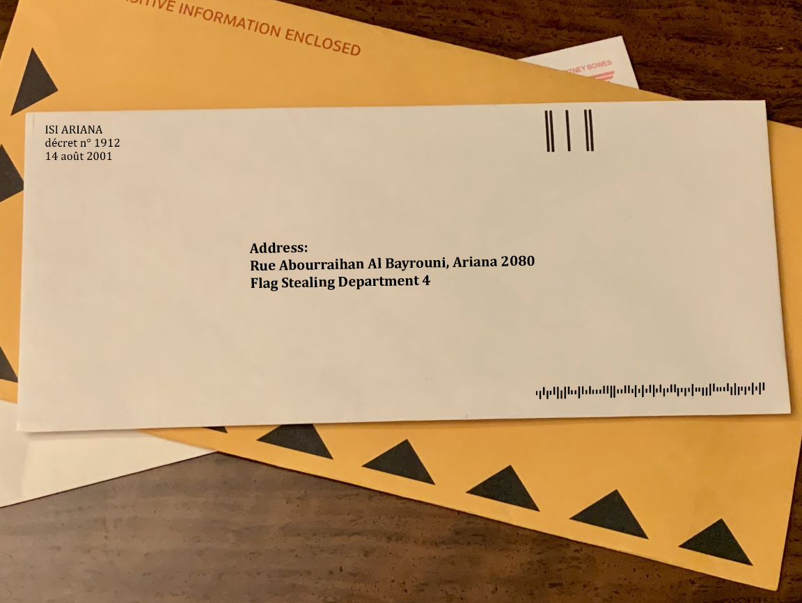
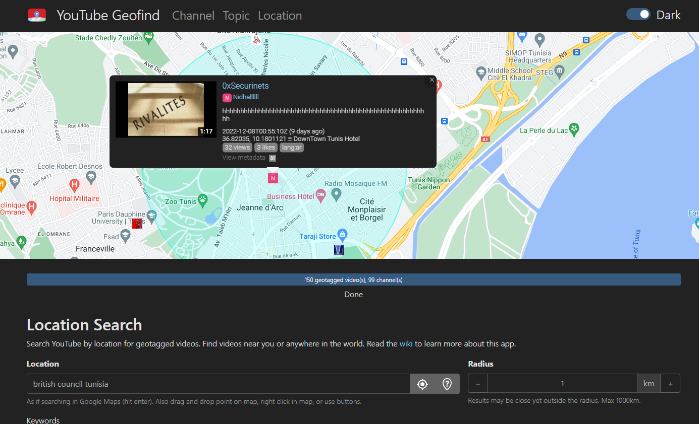
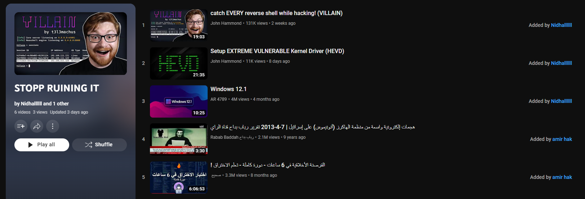
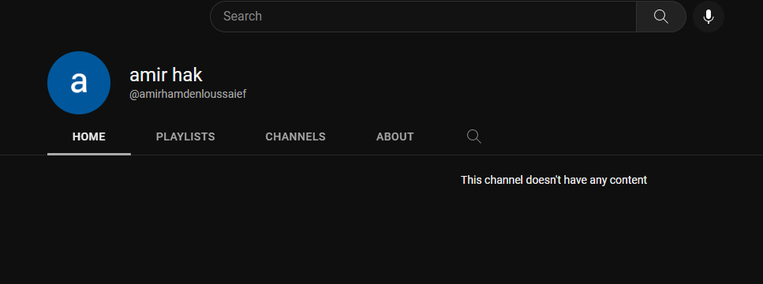
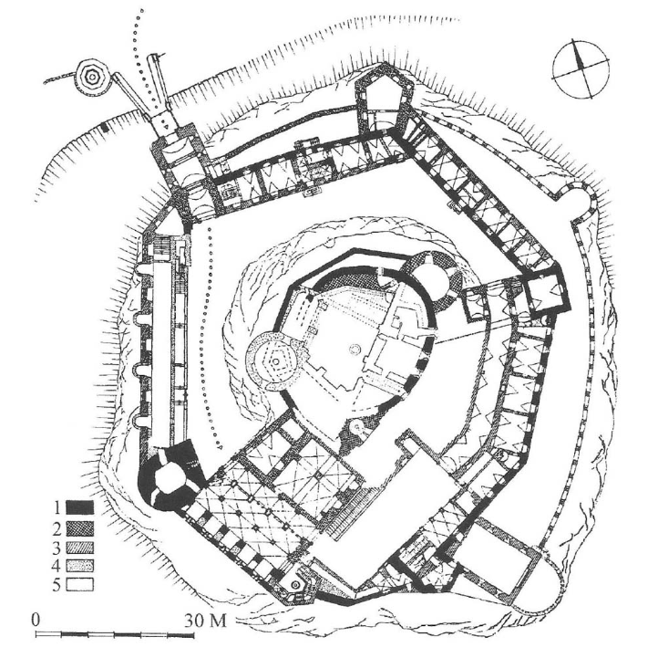
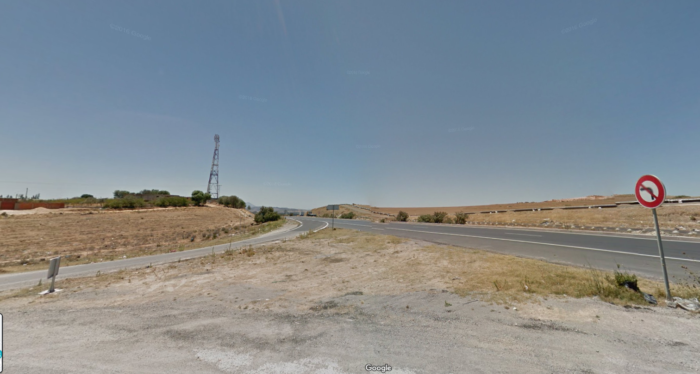
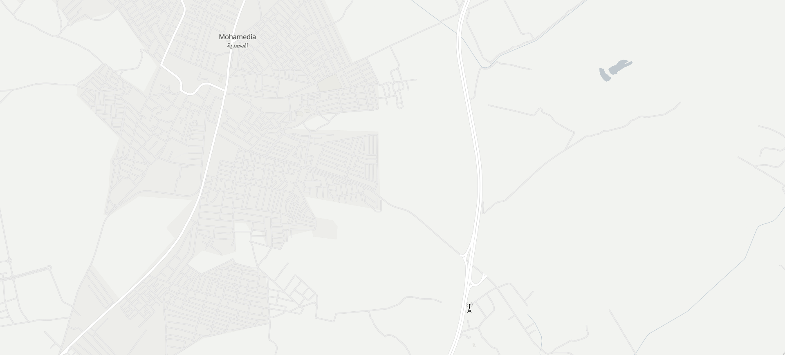

# OSINT minCTF ISI
### Challenge Group | medium | OSINT | 1842 points

[An0nym0us-      500 points](#An0nym0us--500-pts) \
[Anonymous 1.0 - 500 points](#Anonymous-1.0-500-pts) \
[Anonymous 2.0 - 500 points](#Anonymous-2.0-500-pts) \
[Anonymous 3.0 - 800 points](#Anonymous-2.0-800-pts) \
[Extra an0n    - 800 points](#Extra-an0n--800-pts) \
[La5t_k3yyyyyy - 800 points](#La5t-k3yyyyyy-800-pts) \
[1S1 search -    500 points](#1S1-search-500-pts) \
[___TAR___ -     500 points](#___TAR___-500-pts) 

## An0nym0us | 500 pts
### Description
We have identified this BSSID "00:1B:BF:BB:E7:B24" on our network which seems very suspicious,
we count on you to investigate!
Wrap what you find in Securinets{}
Author: NDLx0
<br /> <br />
### Solution
Searching `bssid finder` on Google brings up this website - [https://www.wigle.net/](https://www.wigle.net/)
Top Right you can find `Advanced search`.Click it
There you can put the BSSID you have and run a query.
Searching will get you 1 record of that net ID.SO you `Click on it for more details`
and you'll get this page:
Computed Network Properties:
```bash
Network ID	    00:1B:BF:BB:E7:B2
Network Name	
Type	        infra
Encryption	    (none)
Channel	11
Beacon Interval	
SSID	        appart
Est. Latitude	36.82078934
Est. Longitude	10.18037415
First Seen	    2011-08-26T21:01:47.000Z
Most Recently   Seen	2011-08-28T22:41:11.000Z
comment	        Appended by NDLx0 on 2022-12-06 04:12:42: 87:52:53:95:81:117:49:116:101:95:69:97:53:121:33:63
```


what is unusual is the comment containing :  
Appended by NDLx0 on 2022-12-06 04:12:42: `87:52:53:95:81:117:49:116:101:95:69:97:53:121:33:63`
Taking that number to [https://www.dcode.fr/cipher-identifier](https://www.dcode.fr/cipher-identifier) will help you with identifiying the cipher.
Results will get you ASCII code So u decrypt it with any tool to get the flag : `W45_Qu1te_Ea5y!?`
<br /> <br />
## Anonymous 1.0 | 500 pts
### Description
The reports we received about an anonymous hacker in ISI are true.
He goes by the alias "mookh5e7er" and has obtained some sensitive information. 
We need your help to find and bring the flag Scavenger!
Flag format Securinets{XXX_X_XXXX_XX}
Author: NDLx0]()
<br /> <br />
### Solution
The challenge provided you a username.The first natural step is to look that up in social media.You can do it manually or install [sherlock](https://github.com/sherlock-project/sherlock) and do this command : python3 sherlock.py mookh5e7er
There you'll find an instagram account with an interesting video. Opening it you'll hear a sound of dial tones.
After knowing that what matters most knowing what was the user typing, you'll need first to download the video to extract the sound and you can use this command : 
`ffmpeg -i <infile> -ac 2 -f wav <outfile>`
Then you can run the file through this tool :  [dtmf-detect](https://unframework.github.io/dtmf-detect/)
to decodes the tones into 435446764696165#665#666#725#66661677
Again running what you have in [https://www.dcode.fr/cipher-identifier](https://www.dcode.fr/cipher-identifier) will get you to this [MMulti-tap Phone (SMS)](https://www.dcode.fr/multitap-abc-cipher)
Running the ciphertext through it will get you SECURINETS LEFT BRACE DID U MISS ME RIGHT BRACE 
which is the flag `Securinets{DID U MISS ME}`
<br /> <br />
## Anonymous 2.0 | 500 pts
### Description
We learned that every evening, our client walks 40 minutes from ISI to his gym.
Locating the gym will be quite beneficial.
The flag will be there someplace, wrap it in Securinets{REDACTED}
Author: NDLx0
<br /> <br />

### Solution
The initial thought is to use Google to find out how many kilometers a regular person walks in 40 minutes to get this .
s/40.png)
Knowing the coordinates of ISI, you'll need to check every gym on a radius of 4km. Quite exhausting isn't it ?
Here's this tool [KML Circle Generator](https://kml4earth.appspot.com/circlegen.html) that will give you a file `circle.kml`
to then upload in here [google maps](https://www.google.com/maps/d/u/0/)
s/circle.png)
The closest gym is `Galaxy Gym Montplaisir`. Acceding google maps reviews you'll find your flag here : 
s/4km.png)

Flag : `Securinets{TH3_R34L_G306U3SS3R}`


From the file name, we know its the secret token to Asana, that helps companies track and manage their work. So now we need to find the commit in which the secret was added. It is added in just a few commits prior - `added .gitignore`. Quick intro to .gitignore: A gitignore file specifies intentionally untracked files that Git should ignore. This includes files that contain confidential information, like passwords and secret keys.
<br /> <br />
## Anonymous 3.0 | 800 pts
### Description
You did an excellent job of locating the gym.
Our man is still keeping something about the university a secret.
You'll use the information you obtained from the last task to figure out what we're missing.
Author: NDLx0

<br /> <br />

### Solution
This challenge had quite a few steps. As someone who hadn't tried much of OSINT before this,
One of the main informations you got from last challenge is the new username. So why u don't look that up with sherlock again: python3 sherlock.py M0khse7er
This time a twitter account will appear.Acceding to it you'll see these 2 tweets :

The first thing to come to mind is finding a way to see the deleted tweets. After some digging, you'll discover that [The Internet Archive](https://archive.org/web/), often known as the Wayback Machine, allows users to see archived versions of websites. You must copy the Twitter account address and look it up on there
The results are these :
.
Clicking on that snapshot will get you a picture of that profile at a certain date which happens to be date where the tweet is still visible
.
The link in the picture will lead you to a pastebin named `Secret logs` containing this link :
http://www.isi.rnu.tn/drop/U2VjdXJpbmV0c3tVX1MzM21fTDFrZV9QdTVoaW42X1VyX2wxbTF0c190aDNSM30= 
Acceding it won't get a result so why we don't decode the link drop.
Knowing it's based64 you can just run this command to decrypt it using simply this command :
```
$ echo -n 'U2VjdXJpbmV0c3tVX1MzM21fTDFrZV9QdTVoaW42X1VyX2wxbTF0c190aDNSM30=' | base64 --decode
Securinets{U_S33m_L1ke_Pu5hin6_Ur_l1m1ts_th3R3}
```
Flag: `Securinets{U_S33m_L1ke_Pu5hin6_Ur_l1m1ts_th3R3}`
<br /> <br />
## Extra an0n | 800 pts
### Description
This letter was intercepted on its way to ISI 
Unfortunately,it was empty.
If u find something wrap it in Securinets{}
Author: NDLx0
This is the image : 



<br /> <br />
### Solution
Examining the metadata info, you'll find nothing, That's why you need to focus on the barcode in the letter.
After some serious digging into the rabbit hole,You'll find out that this is an IMB Barcode, which will lead you to this tool by USPS to decode IMB barcodes:

On decoding the barcode, we get 5 numeric parameters & on joining them together we get a large numeric sequence:
`11048951127249531051105410333` And guess what it is ASCII again so decoding it will get you the flag 
`Securinets{n0T_pH15in6g!}`
<br /> <br />
## La5t_k3yyyyyy | 800 pts
### Description
According to Cypher, the WiFi hotspot was also used to share a video on the internet.
It is necessary that we identify it since it might be the key to discovering our guy's full name.
(Hint : Flag format : Securinets{full_name})

(Hint: You will need to pivot off of the email found in the past challenge!)
<br /> <br />

### Solution
You need to look for a tool that Search YouTube by location for geotagged videos. And that happens to be [youtube-geofind](https://mattw.io/youtube-geofind/location)
Bringing what you found from `Wigle` is the location of the bssid which is near Britsh Council. Now comes the tool:
While looking through one of the few videos, you'll come across this: 

In the youtube channel `about` you'll notice an email address which is : nidhal.h.loussaief@gmail.com
Now you have the name of our guy but not the full name because it's missing the middle name that we can see it starts with `h So we keep looking in the channel until we come across a playlist made buy our guy:
`
We see that there's another guy added to the party adding videos to the playlist.
We check his channel and it's that little kid and we can see clearly his full name 

That gives us our guy's full name which is `nidhal hamden loussaief`
Flag: `Securinets{nidhal_hamden_loussaief}`
<br /> <br />
## 1S1 search | 500 pts
### Description
You were given an architecture of a castle in an image and you were supposed to get the closest zoo to the castle
Flag format: Securinets{xxxxxxx_xxxxxxxxxx_xxxxxxx}
here's the image: 

<br /> <br />

### Solution
This is an easy challenge which requires just to search image with google image search, the thing will lead you to the name of the castle `Bojnice Castle`
Opening Google Maps and you'll the closest zoo to the castle named `národná_zoologická_záhrada`
Flag: `Securinets{národná_zoologická_záhrada}`
<br /> <br />

## ___TAR___ | 500 pts
### Description
This challenge came up with an aircraft image and you have to find what airport the craft left today
Here's the image: 


<br /> <br />

### Solution
The first thing to come across you is to visit the website down there which is airteamimages.com
There you'll find an id search bar, type the id in the picture `394701` and you'll find the plane.
On the right there's Aircraft tracking, when you click it a Radar map will show you form where this plane took off which is Hamburg Airport
Flag: `Securinets{hamburg_airport}`
<br /> <br />
## Ge0Guess3r | 1000 pts
### Description
The password of 0x0.rar is: 
The md5 hash of the Wikipedia page of Tunisia

Clarification: md5(https://en.wikipedia.org/wiki/Tunisia)
		   =5f1d849355f0964ae2463743c37634a7


The password of 1x0.rar is: 

The md5 hash of the Wikipedia page of the place in (1x0.png)

Clarification: md5(https://en.wikipedia.org/wiki/[redacted])


The password of 2x0.rar is:

The md5 hash of the Wikipedia page of the place in (2x0.png)

Clarification: md5(https://en.wikipedia.org/wiki/[redacted])


The password of 3x0.rar is:

The md5 hash of the Wikipedia page of the place in (3x0.png)

Clarification: md5(https://fr.wikipedia.org/wiki/[redacted])

0x0.rar
### Solution
Opening the rar file with the first password gets you a new rare file named 1x0.rar and an image: 

we run a search on google using google image we find that this picture in la marsa but we're looking for more specification.After some digging you'll find out thats Gammarth.
All you need now is to do what the description told you to do.
Passing to the second image: 

Zooming at the picture you'll see cinéphile searching it you'll know that there's only one in Tunisia and it's in elmenzah and that's your location.
Third and last one is quite hard to find but not impossible: 

Examining the image and trying to find some clues,
1/We're on a highway 
Except that you'll think you're on a dead end but no, If you look closely, you'll notice a "telecom," which comes to be useful because we have our own infrastructure map. https://openinframap.org/
Keeping only labels and telecom layers there make things easier for you.
 Now come the first clue to be useful which will filtrate where to look
 To find finally this: 
 
 That will lead you to your place which is mohamedia
 
 finally you'll find a txt file with: 
Flag: `Securinets{fc4297c3ca24554c73e2b8374d13f41d}`


